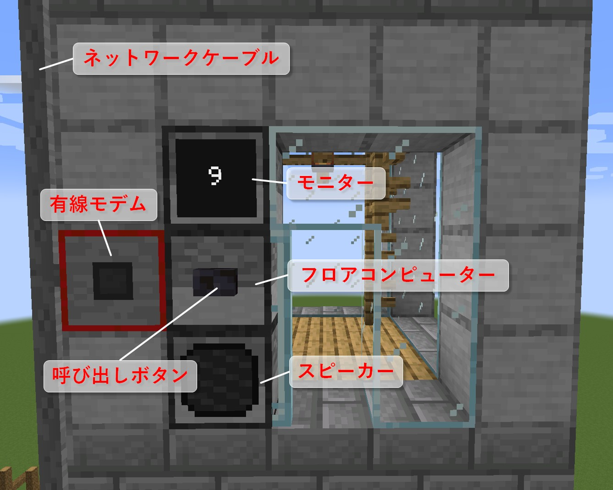
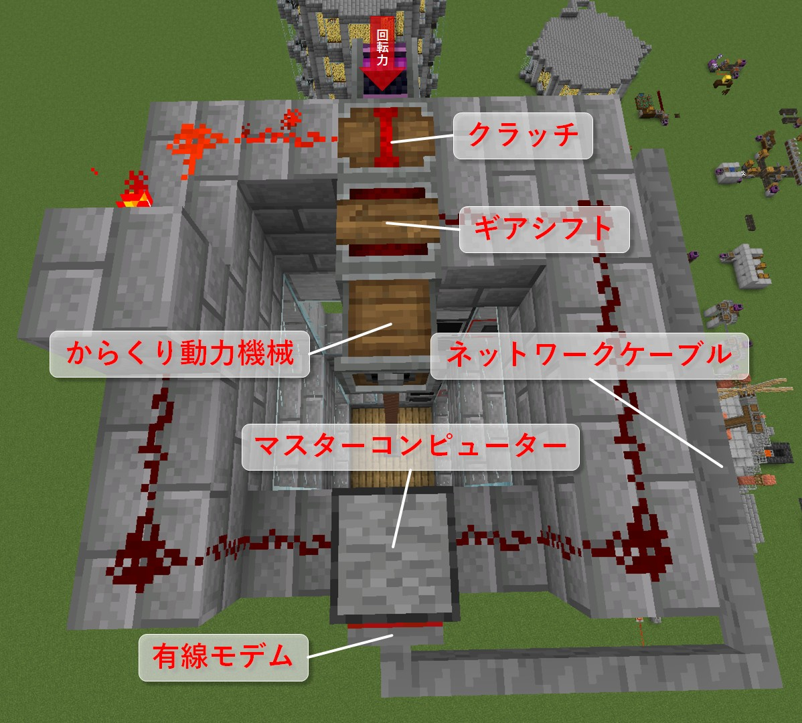
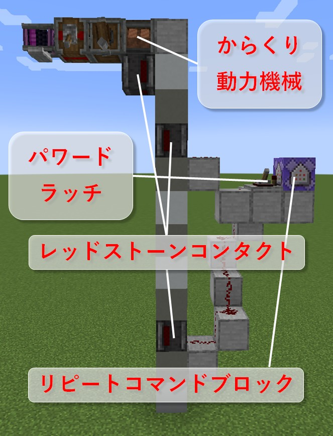

# ComputerCraft-CreateElevator
[Create](https://www.curseforge.com/minecraft/mc-mods/create)で作成した、からくりエレベーターを制御する[ComputerCraft](https://www.curseforge.com/minecraft/mc-mods/cc-restitched)用のプログラムです。

## 特徴
- Createのからくり装置で作成した、エレベーターを、Createでは複雑で実現の難しい制御を実現しています。
- [クラッチ](https://create.fandom.com/wiki/Clutch)と[ギアシフト](https://create.fandom.com/wiki/Gearshift)のみで制御します。
- ネットワークケーブルが許す限り、どんな長さ・階層のエレベーターにも対応出来ます。
- 任意の階まで止まる事なくエレベーターが動きます。
- 呼び出し機能があります。ボタンを押す事でその階までエレベーターを動かす事が出来ます。
- 階層表示に対応しています。モニターで今のエレベーターの場所、移動方向を確認出来ます。
- エレベーター扉の自動開け閉めに対応しています。エレベーターが到着したらその階の扉を開け、エレベーターが出発したら扉を閉めます。
- 到着音に対応しています。エレベーターが到着したら音が鳴ります。
- 設定を容易に行えるインストーラーが付属しています。

## 動作環境
このプログラムを作成した環境です（必要なもののみの記載となります）。しかし、これら以外の環境（バージョン違い等）でも動作する可能性があります。

- [Minecraft](https://www.minecraft.net) v1.19.2
- [Fabric loader](https://fabricmc.net/) v0.14.12-1.19.2
- [Fabric API](https://www.curseforge.com/minecraft/mc-mods/fabric-api) v0.72.0+1.19.2
- CC: Restitched v1.101.2
- Create v0.5.0g-796+1.19.2

## エレベーターの条件
このプログラムが使用するには以下の条件全てを対象のエレベーターが満たしている必要があります。

- Createのからくり装置（[メカニカルピストン](https://create.fandom.com/wiki/Mechanical_Piston)・[ローププーリー](https://create.fandom.com/wiki/Rope_Pulley)・ガントリーシャフトと[ガントリーキャリッジ](https://create.fandom.com/wiki/Gantry_Carriage)等）で作成されている。
- 各階の間隔が一定である。
- エレベーターの昇降速度が一定である。
- エレベーターの全長が256ブロック以内である（[ネットワークケーブル](https://www.computercraft.info/wiki/Networking_Cable)の長さ制限の為、実際にはもう少し余裕が必要です）。

## エレベーターの構築
このエレベーターシステムは、各階の行き先入力・呼び出しボタン・扉の開け閉め等を制御する**フロアコンピューター**と、フロアコンピューターを統括し、エレベーターの制御を行う**マスターコンピューター**の2種類のコンピューターから構成されます。フロアコンピューターは各階に1台ずつ設置し、マスターコンピューターは1つのエレベーターシステムに1台のみ設置します。

### フロアコンピューター
フロアコンピューターの構築は各階に対して行います。

- コンピューターは有線モデムを通じて、マスターコンピューターと接続します（他のフロアコンピューターと共に一本のネットワークケーブルでマスターコンピューターに接続すると良いです）。
- [上級モニター](https://www.computercraft.info/wiki/Advanced_Monitor)を使用するとカラー表示になりますが、[（下級）モニター](https://www.computercraft.info/wiki/Monitor)でも視認性を落とす事なく使用できます。
- 呼び出しボタンとエレベーターの扉はコンピューターがレッドストーンを伝達出来る範囲内に設置して下さい。

### マスターコンピューター
マスターコンピューターの構築はエレベーターシステム全体に対して1台のみ行います。

- マスターコンピューターはネットワークケーブルを通じて、エレベーターシステム内の全てのフロアコンピューターと接続します。
- それぞれ異なる面から、マスターコンピューターとクラッチ・ギアシフトをレッドストーンで接続します。
  - クラッチのレッドストーン信号は反転させて下さい。

## エレベーターシステムのインストール
[エレベーターの構築](#エレベーターの構築)で設置したフロアコンピューターとマスターコンピューターにそれぞれの制御プログラムをインストールします。インストール方法には、[インストーラーを使用する方法](#インストーラーでのインストール)と、[手動でインストールする方法](#手動でのインストール)があります。

### インストーラーでのインストール
1. このレポジトリにあるluaファイルを全て1つの[フロッピーディスク](https://www.computercraft.info/wiki/Floppy_Disk)にコピーします。
2. フロアコンピューター・マスターコンピューターに[ディスクドライブ](https://www.computercraft.info/wiki/Disk_Drive)を接続し、1.のフロッピーディスクを入れ、システムにマウントします。
3. `cd disk/`でカレントディレクトリを1.のフロッピーディスクのルートディレクトリにします（マウント名は適宜変更して下さい）。
4. フロアコンピューターでは`install_floor`を、マスターコンピューターでは`install_master`を実行してインストーラーを起動します。
5. 表示される質問に答えてプログラムの設定をします。設定の際は[こちらの表](#手動でのインストール)を参考にして下さい。
6. インストールが完了したらコンピューターを再起動します。

### 手動でのインストール
1. フロアコンピューターでは[logger.lua](logger.lua)・[floor.lua](floor.lua)を、マスターコンピューターでは[logger.lua](logger.lua)・[master.lua](master.lua)をルートディレクトリにコピーします。
2. `floor.lua`や`master.lua`を`startup.lua`に名前変更します。
3. `startup.lua`を`edit`で開いて、`Config = { ... }`の{ }内を編集してプログラムの設定をします。

   #### フロアコンピューター
   | 項目 | 説明 | 有効な型 | 初期値 |
   | - | - | - | - |
   | `buttonFace` | 呼び出しボタンのレッドストーン入力を受けるコンピューターの面 | `string`（`top`・`front`・`left`・`back`・`right`・`bottom`） | "back" |
   | `doorFace` | エレベーターの扉を制御する為にレッドストーン信号を出力するコンピューターの面 | `string`（`top`・`front`・`left`・`back`・`right`・`bottom`） | "left" |
   | `floor` | このフロアコンピューターがある階数。同じエレベーターシステム内の他のフロアコンピューターとの重複は許されません。 | `number` | 1 |
   | `roofFloor` | 最上階を屋上表示「R」とするかどうか | `boolean` | true |

   #### マスターコンピューター
   | 項目 | 説明 | 有効な型 | 初期値 |
   | - | - | - | - |
   | `clutchFace` | クラッチを制御する為にレッドストーン信号を出力するコンピューターの面 | `string`（`top`・`front`・`left`・`back`・`right`・`bottom`） | "left" |
   | `gearShiftFace` | ギアシフトを制御する為にレッドストーン信号を出力するコンピューターの面 | `string`（`top`・`front`・`left`・`back`・`right`・`bottom`） | "right" |
   | `minFloor` | このエレベーターシステムの最下階のフロア | `number` | 1 |
   | `maxFloor` | このエレベーターシステムの最上階のフロア | `number` | 10 |
   | `timeBetweenFloors` | エレベーターが1階層分移動するのに要する時間（参考までに、ローププーリーが64RPMで6m移動するのに要する時間は2.4です、移動時間の測定には[こちら](#エレベーターの移動時間の測り方)を参考にして下さい。） | `number` | 2.4 |

4. コンピューターを再起動します。

## 使用方法
1. フロアコンピューターが起動すると、モニターに「?」と表示され、マスターコンピューターの検出を試みます。マスターコンピューターを検出するとモニターにエレベーターの位置と移動方向が表示されます。マスターコンピューターが検出出来ないと、5秒おきに再検出を試みます。
2. マスターコンピューター検出後、フロアコンピューターのターミナルには、

   > This is floor \*\*. 
     Enter the floor which you want to go (\*\*-\*\*). 
     \>_

   と表示れます。ここに行きたい階を入力するとエレベーターがその階に移動します。
3. また、呼び出しボタンを押す事でエレベーターをその階に呼ぶ事が出来ます。
4. エレベーターが移動中はフロアコンピューターのターミナルに、

   > The elevator is moving. Please wait.

   と表示され、階層入力や呼び出しボタンを受け付けません。暫くお待ち下さい。

## エレベーターの移動時間の測り方
チートコマンドが使用可能な環境での測定です。

1. `/scoreboard objectives add test dummy`でテスト用のスコアボードを作成します。
2. 以下の装置を組み立てます。この装置は6mの移動時間の測定を行います。[レッドストーンコンタクト](https://create.fandom.com/wiki/Redstone_Contact)の間隔は希望する移動距離に応じて変更して下さい。尚、リピートコマンドブロックは`/give @p minecraft:repeating_command_block`で入手します。

   

3. 2.の装置のリピートコマンドブロックに`/scoreboard players add #dummy test 1`と入力します。
4. からくり動力機会を動かして、2つのレッドストーンコンタクトを通過する時間を測定します。
5. `/scoreboard players get #dummy test`と入力して結果を得ます。
6. 実際にマスターコンピューターに設定する際は5.で得られた結果を20で割って設定します。

## 注意事項
- エレベーターが動いている時にエレベーターがあるチャンクがアンロードされる、ゲームを終了する等でプログラムが停止しないようにして下さい。再ロード時にシステムのエレベーターの位置と実際のエレベーターの位置に差異が出ます。
- エレベーターの位置に差異が出た場合は、一度エレベーターを最下階又は最上階に移動させて下さい。